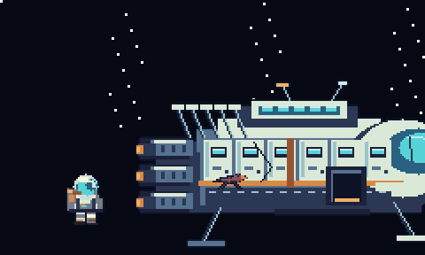

# Documentation Portfolio — Pale Horizon

Pages follow the order required by the TSA Video Game Design event guide.

---

## a. Title page (1 page)

**Event:** Video Game Design

**Title of the video game:** Pale Horizon

**Conference city and state:** ______________________

**Year:** 2027

**Team identification number:** ______________________

---

## b. Purpose and description, target audience, how to play, controls (maximum 2 pages)

### Purpose

*Pale Horizon* is a browser-playable stealth-and-puzzle adventure that shows a familiar
survival loop — crash, scavenge, escape — and then asks who pays for it. The player gathers fuel from
three living worlds to repair a ship. At the end, the AI assistant who sent them there admits it knew the
planets needed that fuel to survive. The player chooses: give it back, or go home. The purpose is to make a
resource-extraction question playable rather than preachable, which gives the game social and educational
value beyond its puzzles.

### Description

The player wakes from cryo-sleep on **Exxos**, a jungle world 142 million light-years from Earth, with a
cracked cryo-pod and empty fuel tanks. Aboard the crashed ship, the AI assistant **Cyu** opens three
destinations:

1. **Exxos — Stealth World.** A planet of predators with heightened senses. They see in a cone in front of
   them and hear you when you run. The player sneaks through tall grass, takes three fuel cells, and
   reaches the far beacon.
2. **The World of Regrets.** Boss **Moria** tore his own soul out of his body. The player pushes rune blocks
   onto pressure plates to open three seals, then carries Moria's soul orb back to his body. This is
   deliberately **not a fight** — there is no attack button in the game. Moria hands over the fuel and a
   cryo-pod part once his soul is home.
3. **World 3 — The Hollow Signal.** A storm world whose power grid died with its people. The player carries
   ember charges from chargers to relays to raise bridges and open a sealed gate, while wind gusts shove
   them around and searchlight drones sweep the platforms.

Between worlds the player can fly the **Asteroid Run**, a 45-second dodge route that pays salvage.
With 9 fuel cells and 3 pod parts aboard, the player repairs the cryo-pod, learns Cyu's secret, and chooses
one of two endings: **Homecoming Deferred** (give the fuel back and stay stranded) or
**The Long Way Home** (keep it and fly home).

Three difficulty tiers let a first-time player and a veteran both get the right challenge: **Explorer**
(6 masks, slower and shorter-sighted enemies, harmless water), **Standard** (5 masks), and **Nightmare**
(3 masks, faster and sharper enemies, windier storms, fewer asteroid shields).

### Target audience

Ages 8 and up, ESRB **E for Everyone**. It is designed for (a) TSA judges who have a few minutes to reach
level 3, (b) the team's classmates and family playing in a browser, and (c) teachers looking for a short
discussion hook about resource use and honest AI. No reading is required beyond short dialogue lines, and
nothing on screen is violent or frightening.

### Accessibility and difficulty options

- **Three difficulty tiers** (Explorer / Standard / Nightmare) set the mask count, enemy speed and vision,
  how long an alert lasts, whether water hurts, wind strength and asteroid shields. Difficulty is shown on
  the HUD and can be changed at any time from the menu or the pause screen.
- **Audio mixer** with separate Master, Music, Effects and Ambience sliders plus a one-key mute (`M`).
- **Chapter select** so nobody has to replay content to see later levels.
- **Touch controls** appear automatically on tablets and phones.
- **No reading barriers**: every puzzle is taught visually (glowing plates, ember light, coloured cones)
  and by short one-line dialogue.

### How to play

- **Goal.** Collect 3 fuel cells and 1 cryo-pod part on each of the three worlds, return to the ship,
  install the pod hatch, then launch and choose your ending.
- **Stealth.** Predators see a translucent cone in front of them and hear running. Hold the sneak key to
  move quietly — sneaking halves the range at which predators notice you. Standing still inside tall grass
  makes you invisible to them and the HUD reads **HIDDEN**. Drones ignore grass but walls and platforms
  block their view.
- **Movement kit.** Run, jump (hold for height), sneak, **dash** (`Q`/`SHIFT`, one extra dash in mid-air),
  and **wall-slide + wall-jump** to climb narrow shafts. Nothing in the kit attacks; every skill is for
  reaching places the player could not otherwise reach or avoiding being seen.
- **Getting caught** costs one of your **masks**, knocks you back and briefly makes you invulnerable. Losing
  every mask returns you to the last **beacon** with a full suit — never to the start of the game — and
  everything you collected stays collected. Water does the same.
- **Beacons** are both checkpoints and refills: standing at one restores the suit and saves your position.
- **Puzzles.** Push the rune blocks onto the glowing plates to open the sealed doors in the World of
  Regrets. On the Hollow Signal, take an ember charge from a charger and use it on a relay to raise bridges
  and open the seal.
- **Carrying.** Interact (**E**) with Moria's soul orb to carry it; walk east to his body to reunite them.
- **No combat.** There is no attack button, no weapon, and no enemy that can be defeated. Moria is
  deliberately *not a fight*: the player solves puzzles and brings his soul back.
- **Reviewers and judges:** the main menu's **Chapter select** unlocks all three missions immediately, so
  the third level can be reached in one click.

### Control functions

| Input | Function |
| --- | --- |
| `←` `→` / `A` `D` | run left / right |
| `SPACE` / `W` / `↑` | jump (hold longer for a higher jump) |
| `↓` / `S` | sneak: slower, quieter, hides the player in tall grass |
| `Q` / `SHIFT` | dash (one extra dash while airborne) |
| wall + `SPACE` | wall-slide, then wall-jump |
| `E` / `ENTER` | interact: beacons, relays, chargers, consoles, the soul orb, Moria |
| `TAB` / `ESC` | pause menu (objective, collected counts, options, restart, quit to menu) |
| `M` | mute / unmute sound |
| `F3` | debug overlay (fps, scene, masks, enemy alert state) |
| On-screen buttons | the same actions, shown automatically on touch devices |

---

## c. Storyboard

The storyboard was generated directly from the game's own pixel art so that it matches the final product
panel for panel. Full-size sheet: [`storyboard.png`](storyboard.png).

Six beats: (1) the crash and cryo-wake, (2) the Cryo Bay hub and its stations, (3) Exxos stealth with a
predator's vision cone, (4) the World of Regrets rune-block puzzle and Moria with his separated soul,
(5) the Hollow Signal relay bridge and searchlight drone, (6) the ending choice.

| Panel | Beat | Design intent |
| --- | --- | --- |
| 1 | Crash | establish isolation and scale immediately |
| 2 | Cryo Bay | teach the three stations; menu-in-world for the designer's main-menu screen |
| 3 | Exxos | teach cone + grass hiding with no text |
| 4 | World of Regrets | establish "puzzle, not fight" visually — no weapons drawn anywhere |
| 5 | Hollow Signal | teach carrying a charge to a relay; show the hazard without violence |
| 6 | The choice | end on the moral decision, not a victory screen |

A hand-drawn version of this beat sheet can be produced from the same six panels if the judges require
pencil work; the generated sheet is the layout guide.

---

## d. Student copyright checklist (1 page)

Checklist items and this entry's answers:

| Item | Answer |
| --- | --- |
| Music, lyrics, sound recordings used? | No. All audio is synthesised at runtime by the game's own WebAudio code |
| Photographs, illustrations, images used? | No third-party images. Every sprite and tile is generated by the team's own Python/Pillow scripts in `art/` |
| Text or quotations from other sources? | No. All dialogue, names and story text are original to this entry |
| Video or film footage used? | No |
| Fonts embedded or downloaded? | No. The interface uses the operating system's default monospace font |
| Code libraries or frameworks used? | No. The engine is plain HTML5 canvas + ES modules written for this entry |
| Trademarked names or logos used? | No. The design document's planet name "Exxon" was changed to "Exxos" precisely to avoid a trademark conflict |
| Copyrighted game mechanics copied? | No. Stealth cones, pressure plates and carrying puzzles are generic genre mechanics, implemented from scratch |
| Permission letters needed? | None. No third-party copyrighted material appears in the game |

Team members confirm that the work submitted is the original work of the team, with AI assistance as
documented in the AI reflection below.

---

## e. Permission letters

Not applicable — no copyrighted material is used in this entry. If any later revision adds licensed art,
music or sound, the signed permission letter must be inserted here.

---

## f. Resources and AI reflection (maximum 4 pages)

### What the team used

- **Design source material:** the team's own concept document (`video game design ideas.pdf`) and the TSA
  Video Game Design event guide (`HS_-_Video_Game_Design.pdf`).
- **Tools:** a text editor, a browser, Python 3 with Pillow for the art pipeline, and an AI coding
  assistant (see below).
- **No third-party engines, libraries, art packs or sound packs.** Fonts are bundled locally:
  Chakra Petch, JetBrains Mono, Space Grotesk and IBM Plex Mono, under the SIL Open Font License;
  copyright notices and licenses are included in `game/assets/fonts/`.

### Where AI was used, honestly and specifically

| Area | AI involvement | Human review |
| --- | --- | --- |
| Reading the PDFs | An AI-written PDF text extractor (`tools/pdf_extract.py`) was used because the documents are font-encoded and one is AES-encrypted | Team confirmed the extracted text matched the documents |
| Code | The engine (canvas rendering, tile collision, stealth vision cones, dash/wall-jump movement, puzzle logic, scene flow, WebAudio synthesis) was generated with AI assistance, then debugged by playing | Team played every level, found and fixed bugs (a door that opened before its plates existed, dropped key taps, a stuck pause menu, a block push that teleported the player, a dash that was purely visual) |
| Testing | An AI-written unit-test suite (`tools/test_engine.mjs`), a level-completability validator (`tools/validate_levels.mjs`) and an in-browser self-test (`?selftest=1`) were added so every fix could be re-checked automatically | Team ran the suites before and after each change and re-played the browser build |
| Pixel art | All 138 sprites, tiles and parallax background layers are drawn by AI-written Python scripts from one authored palette (`P` in `art/generate_assets.py`: 53 named colours, plus per-world gradient sets for the skies) — nothing hand-drawn | Team chose the palette direction and the character/ship silhouettes |
| Story and dialogue | Cyu's lines, Moria's dialogue and both endings were written with AI assistance, based on the team's concept document | Team supplied every story beat: crash, Cyu, stealth world, Moria's soul, the twist |
| Documentation | This portfolio was drafted with AI assistance | Team verified requirement coverage against the event guide |

### Ethical reasoning

- **Disclosure in the project, not the game.** Stating AI use inside the title screen misread as portfolio
  copy, so the game ships as a game: the disclosure lives here, in the README and in the design mapping,
  where a judge reading the submission will find it alongside every other note.
- **Reviews, not replacements.** AI was used where it could be checked: generated art is inspected in a
  contact sheet, generated code is played, generated story is chosen by the team. The final creative
  decisions — the setting, the stealth world, Moria, the twist ending — came from the team's document.
- **Copyright safety.** Because every asset is generated from code, the entry contains no third-party
  material, which is also why the planet name was changed from "Exxon" to "Exxos".
- **Honest limits.** The AI did not playtest the fun. The difficulty balance (vision-cone ranges, sneak
  speed, number of fuel cells, mask counts) was tuned by playing, and the team should keep tuning it before
  submission.
- **Effect on the process.** Using AI compressed the art pipeline from days of pixel work into a script
  that can be re-run, which left the team more time for level design and playtesting. It also created a
  risk the team had to manage: generated code looks finished before it is verified, so every scene was
  tested in the browser before being accepted.

### What the team would do next

1. Replace the six generated storyboard panels with hand-drawn versions for the portfolio.
2. Add a fourth world by copying the `M3` level format in `game/src/levels.js` — the document only sketches
   three worlds, so a fourth is a clean place for a new non-violent mechanic.
3. Record the demonstration video: tutorial, one full level, and a walkthrough of the code, art scripts
   and asset folder as the event guide requires.
4. Keep extending the movement kit and puzzle vocabulary — every new ability should stay non-violent, like
   the dash and wall-jump added in the polish pass.
